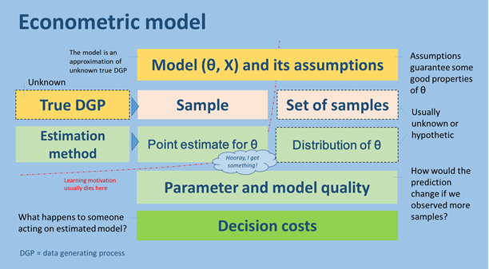

[](https://travis-ci.org/epogrebnyak/LessOLS.jl)
[](https://mybinder.org/v2/gh/epogrebnyak/LessOLS.jl/master)


# LessOLS.jl

Building a simplistic econometrics package.


## Approach

Simulation is a good way to study estimator properties. In real life 
we rarely know the true data generating process and have to search both for 
better model and parameter estimation procedure. 

In `LessOLS.jl` we aim to catalogue several types of data generting processes and show how applying different models and estimators affect quality of parameters estimated. 

Quality of parameters is related to decision outcomes based on model predictions.

## Sister repo

<https://github.com/epogrebnyak/multiple-regression-revisited> (has code in R and text in Russian)

<!-- 



-->

## Steps

1. Define true data generating process (unknown in practice)
2. Create a sample of observations (we usually have just a single sample, not a whole series of samples) 
3. Propose a model and estimation procedure
4. Derive model parameters
5. Repeat sampling (steps 2 and 4, with same step 4) and derive distribution of a parameter
6. Show estimator quality 
7. Tranfsorm estimator quality to understandable decision outcome or costs
8. Talk about bias-variance tradeoff


## In lieu of documentation

### Data structures

- `Sample` holds observation data. It has properties `.X` and `Y.` 
- `LinearModel` has estimation results 

### Methods
- `ols` estimation function retruns linear model 
- `r2`, `yhat`, `desc` work on linear model

## Just a quick reminder of Julia syntax

```julia
function id(x::Int)
    return x
end 
```
